# Compte-rendu 08/10/18 (Administration Linux)

## Création de la machine virtuelle

Pour créer la machine virtuelle sur le cloud de l'école, il faut récupérer ces informations sur le commun.

| Catégorie | Adress                |
| --------- | --------------------- |
| Plage ip  | 172.16.0.82 à 94      |
| Masque    | 255.255.255.240 (/28) |
| Gateway   | 172.16.0.81           |
| DNS1      | 192.168.90.55         |
| DNS2      | 192.168.90.68         |

Il faut suivre la procédure VMM présent également sur le commun.

[Back To The Top](#markdown-worksheet)

---

## Installation de la machine Debian

#### Lancement de la machine

1. sélectionner "install" pour faire une installation classique.
    
    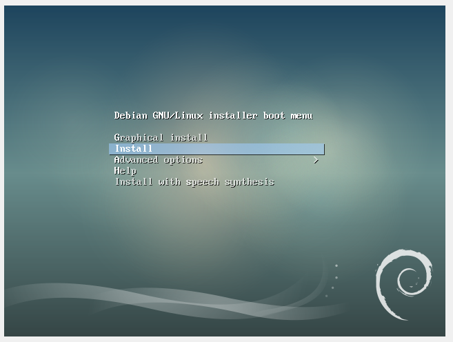

2. Donner un nom à votre machine.

    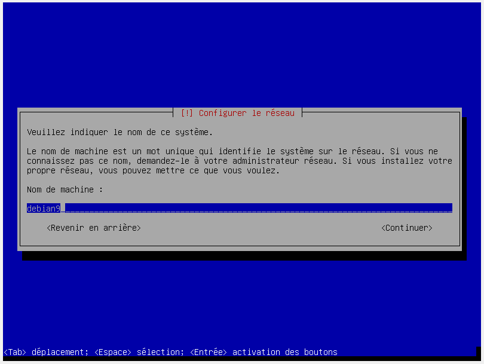

#### Configuration

1. #### Si votre machine ne récupère pas informations toute seule.

    1. Configurer l'ip de la machine.
    2. Configurer le domaine.
    3. Configurer l'adresse de la gateway.
    4. Configurer les DNS.

2. Configurer l'utilisateur root en lui donnant un mot de passe.

3. Créer un nouvel utilisateur en lui donnant un nom d'utilisateur et un mdp.

#### Partionnement

1. Choisir un partionnement Manuel.

    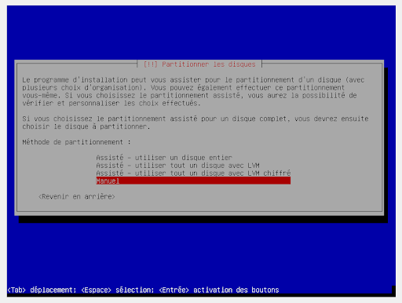
      

2. #### Choisir le disque à partitionner.
   
    1. Valider la création d'une table de partition sur le disque pour allouer l'espace et pouvoir le partionné.
    2. Choisir l'espace libre nouvellement créer.

        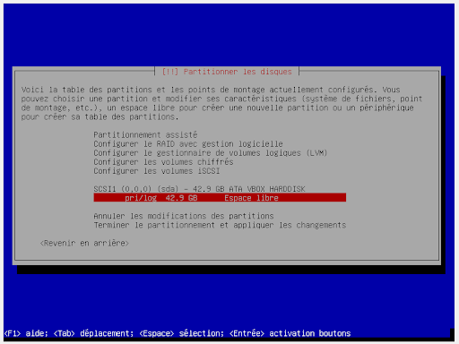
    3. Créer une nouvelle partition.
    4. Mettre l'espace disque nécessaire.
    5. Choisir le type primaire.
    6. Choisir l'emplacement "Début".
    7. Choisir utiliser comme : système de fichiers ext2.

        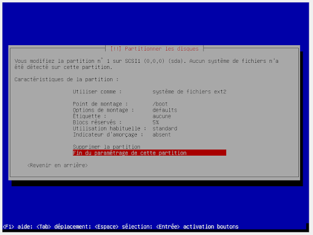
    8. Choisir comme point d'amorçage : /boot
    9. Choisir comme indicateur d'amorçage : présent.

    Utiliser ce tableau pour connaître les partitions à créer.

    | type     | Point d'amorçage | Utiliser comme           | Indicateur d'amorçage | Espace disque |
    | -------- | ---------------- | ------------------------ | --------------------- | ------------- |
    | Primaire | /boot            | système de fichier ext2  | Présent               | 0.5GB         |
    | Primaire | x                | Volume physique pour LVM | Absent                | Restant       |

#### Configurer le LVM

1. Configurer le gestionnaire de volumes logiques (LVM)
2. Mettre oui quand il demande si il faut écrire les modifications sur les disques et configurer les LVM?

    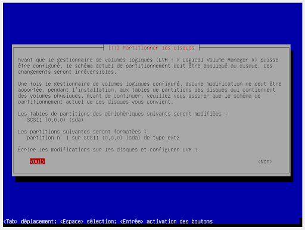
3. Donner un nom au groupe de volume à créer. (Ici vg_00)

4. Associer le bon volume physique au groupe de volume.

   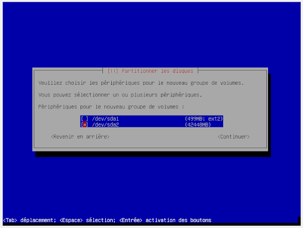

5. Créer les volumes logiques.

    Utiliser ce tableau pour créer les volumes logiques.

    | Taille | Volume Logique |
    | ------ | -------------- |
    | 4 Gb   | lv_root        |
    | 3 Gb   | lv_var         |
    | 2 Gb   | lv_var_log     |
    | 1 Gb   | lv_tmp         |
    | 3 Gb   | lv_usr         |
    | 2 Gb   | lv_home        |
    | 2 Gb   | lv_srv         |
    | 2 Gb   | lv_opt         |
    | 0,5 Gb | lv_var_www     |
    | 1 Gb   | lv_swap        |

    Chaque volume logique est important mais sans le root votre machine ne démarrera pas.

    1. Definir le nom du volume logique.
    2. Définir sa taille.

6. Terminer

    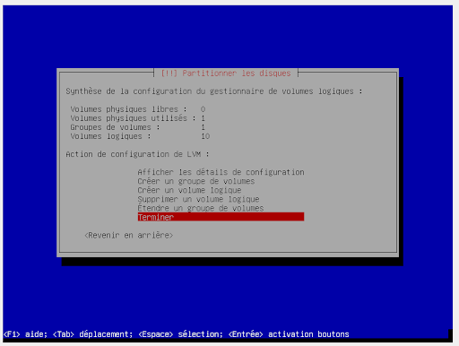

7. Partionner l'espace libre de chape volume logique.

   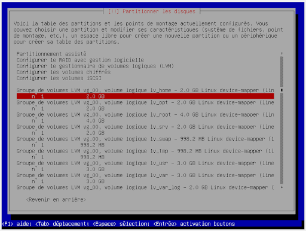

   1. Paramétrer chaque partition à l'aide de ce tableau.

        | Point de montage | Taille | Volume Logique | Système de fichiers |
        | ---------------- | ------ | -------------- | ------------------- |
        | /                | 4 Gb   | lv_root        | EXT4                |
        | /var             | 3 Gb   | lv_var         | EXT4                |
        | /var/log         | 2 Gb   | lv_var_log     | EXT4                |
        | /tmp             | 1 Gb   | lv_tmp         | EXT2                |
        | /boot            | 0,5 Gb |                | EXT2                |
        | /usr             | 3 Gb   | lv_usr         | EXT4                |
        | /home            | 2 Gb   | lv_home        | EXT4                |
        | /srv             | 2 Gb   | lv_srv         | EXT4                |
        | /opt             | 2 Gb   | lv_opt         | EXT4                |
        | /var/www         | 0,5 Gb | lv_var_www     | EXT4                |
        |                  | 1 Gb   | lv_swap        | SWAP                |

        
    2. Terminer

#### Fin de la configuration

1. Demande si l’on doit appliquer les mises a jour au disques répondre Oui
2. Demande si l'on doit utiliser un mirroir réseau répondre Non
3. Dire que l'on ne souhaite pas participer à l'étude statistique.
4. Installer seulement les deux derniers logiciels.
   
   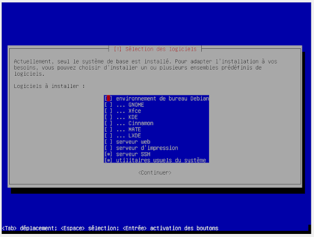
5. #### Répondre OUI à l'installation de grub.
6. Choisir le disque ou installer grub.

[Back To The Top](#markdown-worksheet)

---

## Connexion via putty (SSH)

1. Installer putty.
2. Entrer l'adresse ip et le port.
   
   

3. Pour utiliser le pavé numérique rendez-vous dans Terminal --> Features. Cocher "Disable application keypad mode"

    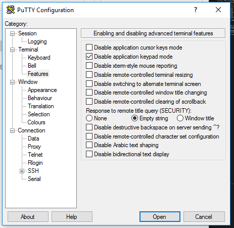

---

## Connexion via clé asymétrique (SSH)

1. Lancer Putty Gen
2. Créer une clé.

    Vous devez générer de l'anthropie pour pouvoir générer une clé vraiment aléatoire. Pour en générer quand cala vous es demandé bouger votre souris.

    

3. Entrer une pass phrase.
4. Sauvegarder votre clé public et privée.

    La privée au format SSH et putty et la public au format putty.

5. Aller dans votre machine dans le dossier /etc/ssh
6. Ouvrir le fichier sshd_config

        nano sshd_config

7. Décommenter la ligne et vérifier que la valeur est sur Yes

        PubkeyAuthentification yes

8. Redémarrer le service ssh

        systemctl restart ssh

9. Créer le dossier .ssh dans /home/"username"

        mkdir .ssh

10. Créer un fichier celui-ci appellé authorized_keys et y coller la clé public trouvable dans putty gen

        nano authorized_keys

    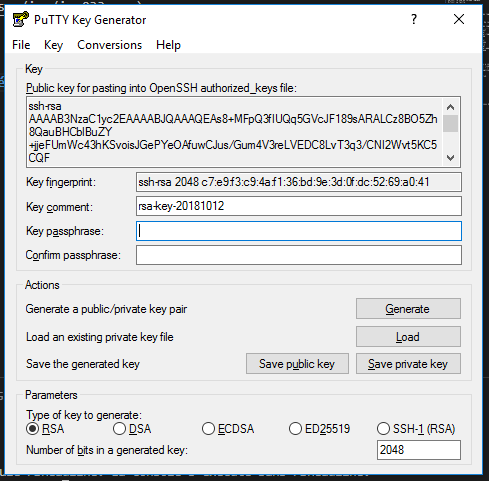

11. Entrer sa clé privée dans putty à l'aide du fichier enregistrer

    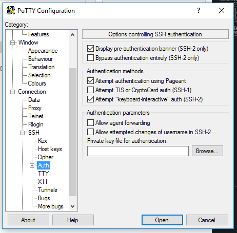

12. à la connection entrer de nouveau la passphrase.
13. Pour éviter d'entrer à chaque fois la passphrase ajouter la dans Pageant.

    Cela vous permettra de ne pas avoir à rettaper la passphrase à chaque fois.

    

    1. Aller chercher votre clé privée
    2. Entrer votre passphrase

---

## Modifier le bashrc pour créer des alias

le but d'un alias est de faire des raccourcis de commande.

1. Rendez-vous dans votre home.
2. Modifier le fichier .bashrc
   
        nano .bashrc

3. Ajouter une ligne d'alias

        alias ls='ls -lah'

4. Lancer la commande bash pour l'activer

        bash

---

## Connection via Filezila/WinSCP (SFTP)

